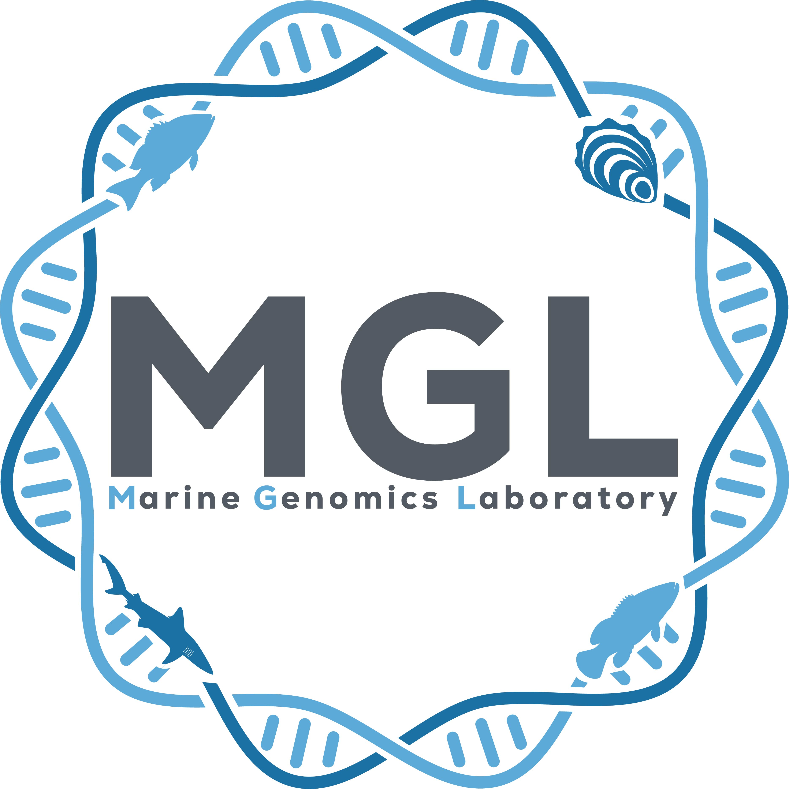

---
# Leave the homepage title empty to use the site title
title:
date: 2022-10-24
type: landing

sections:

  - block: markdown
    content:
      title: |
      text: |
        
        <h1>Marine Genomics Lab</h1>
        The Marine Genomics Laboratory at Texas A&M University-Corpus Christi uses cutting edge, next-generation sequencing technology to address issues of marine conservation and management of exploited marine species. Additionally, we investigate biogeography and phylogenetics, with a focus on taxa found in the Gulf and northern Caribbean. The techniques being developed and utilized in our laboratory allow us to study population structure at an unprecedented resolution and to characterize adaptive aspects of genomic variation important for persistence at local scales and adaptation to temporal environmental fluctuations. 

  - block: slider
    content:
      slides:
        - title: |
          content: 
          align: center
          background:
            image:
              filename: barker.jpg
              filters:
                brightness: 0.7
            position: right
            #color: '#666'
        - title: |
          content: 
          align: center
          background:
            image:
              filename: oleary_boat.jpg
              filters:
                brightness: 0.7
            position: center
        - title: |
          content: 
          align: center
          background:
            image:
              filename: barker_shark.jpg
              filters:
                brightness: 0.7
            position: center
    design:
      # Slide height is automatic unless you force a specific height (e.g. '400px')
      slide_height: ''
      # Make the slides full screen within the browser window?
      is_fullscreen: true
      # Automatically transition through slides?
      loop: true
      # Duration of transition between slides (in ms)
      interval: 5000
  
  #- block: collection
  #  content:
  #    title: Latest News
  #    subtitle:
  #    text:
  #    count: 5
  #    filters:
  #      author: ''
  #      category: ''
  #      exclude_featured: false
  #      publication_type: ''
  #      tag: ''
  #    offset: 0
  #    order: desc
  #    page_type: post
  #  design:
  #    view: card
  #    columns: '1'
  
  #- block: markdown
  #  content:
  #    title:
  #    subtitle: ''
  #    text: 
  #  design:
  #    columns: '1'
  #    background:
  #      image: 
  #        filename: tamucc_wave.jpg
  #        filters:
  #        brightness: 1
  #        parallax: true
  #        position: center
  #       size: cover
  #        text_color_light: true
  #    spacing:
  #      padding: ['20px', '0', '20px', '0']
  #    css_class: fullscreen

  - block: collection
    content:
      title: Latest Publications
      text: ""
      count: 5
      filters:
        folders:
          - publication
        publication_type: 'article-journal'
    design:
      view: citation
      columns: '1'
      show_type: false 

  - block: markdown
    content:
      title:
      subtitle:
      text: |
        {}
    design:
      columns: '1'
---
